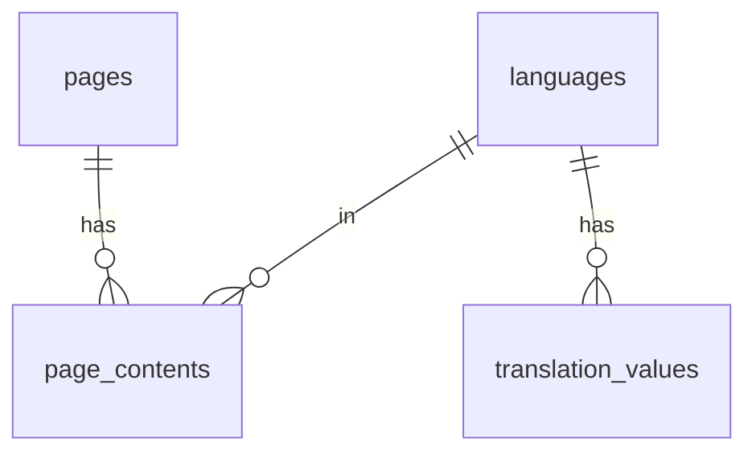

# 資料庫 Schema

資料庫: SQLite (`server/cms.db`)

---

## 核心表

### languages

| 欄位 | 類型 | 說明 |
|------|------|------|
| code | TEXT (PK) | 語言代碼 (en, zh-TW) |
| name | TEXT | 語言名稱 |
| is_default | BOOLEAN | 是否預設 |
| direction | TEXT | ltr/rtl |
| enabled | BOOLEAN | 是否啟用 |

### pages

| 欄位 | 類型 | 說明 |
|------|------|------|
| id | INTEGER (PK) | 主鍵 |
| slug_key | TEXT | 頁面標識 |
| template | TEXT | 模板名稱 |

### page_contents

| 欄位 | 類型 | 說明 |
|------|------|------|
| page_id | INTEGER (FK) | 頁面 ID |
| lang_code | TEXT (FK) | 語言代碼 |
| title | TEXT | 標題 |
| slug_localized | TEXT | 本地化 slug |
| seo_title | TEXT | SEO 標題 |
| seo_desc | TEXT | SEO 描述 |
| content_json | TEXT | 內容 JSON |
| updated_at | DATETIME | 更新時間 |

*PK: (page_id, lang_code)*

---

## 使用者表

### users

| 欄位 | 類型 | 說明 |
|------|------|------|
| id | INTEGER (PK) | 主鍵 |
| username | TEXT | 用戶名 |
| password_hash | TEXT | 密碼雜湊 |
| role | TEXT | 角色 (admin/editor) |

---

## 翻譯表

### translation_values

| 欄位 | 類型 | 說明 |
|------|------|------|
| trans_key | TEXT | 翻譯 key |
| lang_code | TEXT | 語言代碼 |
| value | TEXT | 翻譯值 |

*PK: (trans_key, lang_code)*

---

## ER 關係

