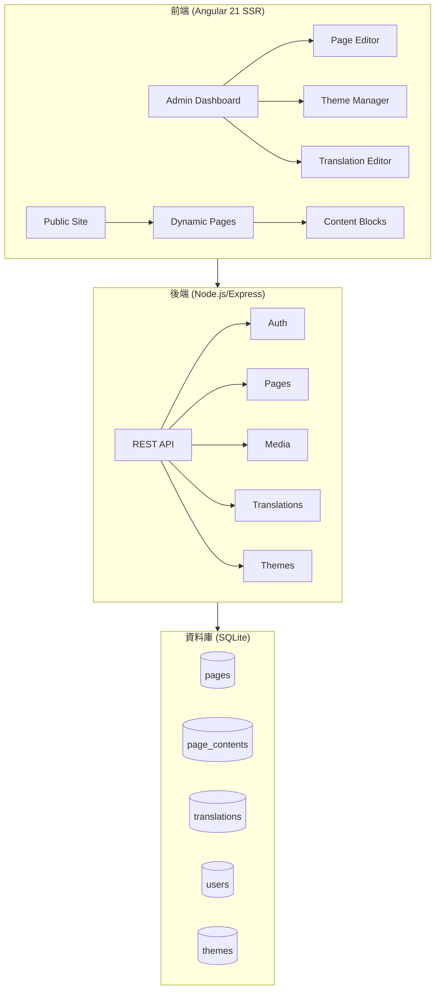

# CMS 專案概述

## 📋 基本資訊

| 項目 | 說明 |
|------|------|
| **專案名稱** | Multilingual CMS |
| **專案類型** | 企業級多語言內容管理系統 |
| **技術棧** | Angular 21 + Node.js + SQLite |

## 🏗️ 架構總覽



## 📁 目錄結構

```
cms/
├── client/                    # Angular 前端
│   └── src/
│       └── app/
│           ├── admin/         # 後台管理模組
│           ├── core/          # 核心服務和管道
│           ├── features/      # 功能模組
│           │   ├── content-blocks/  # 內容區塊組件
│           │   ├── contact-form/
│           │   └── dynamic-page/
│           ├── layout/        # 佈局組件
│           └── shared/        # 共享組件
│
├── server/                    # Node.js 後端
│   └── src/
│       ├── db/               # 資料庫操作
│       ├── middleware/       # 中間件
│       ├── routes/           # API 路由 (17個)
│       ├── migrations/       # 資料庫遷移
│       └── seeds/            # 種子資料
│
├── docs/                      # 專案文檔
└── .agent/                    # AI 助手配置
```

## 🚀 快速入門

### 啟動開發環境

```bash
# 1. 啟動後端
cd server && npm run dev

# 2. 啟動前端 (新終端)
cd client && npm run dev
```

### 預設端口
- **前端**: http://localhost:4200
- **後端**: http://localhost:3000

### 預設帳號
- **管理員**: admin / admin123

## 🔑 核心功能

1. **多語言支援** - 完整的 i18n 國際化系統
2. **頁面編輯器** - 視覺化區塊編輯
3. **主題管理** - 多主題支援和切換
4. **媒體庫** - 圖片上傳和管理
5. **SEO 優化** - sitemap、meta tags、hreflang

## 📚 相關文檔

- [架構設計](file:///Users/andy/Documents/test/cms/cms/docs/architecture.md)
- [內容結構](file:///Users/andy/Documents/test/cms/cms/docs/cms-content-structure.md)
- [SEO 實施](file:///Users/andy/Documents/test/cms/cms/docs/seo_walkthrough.md)
